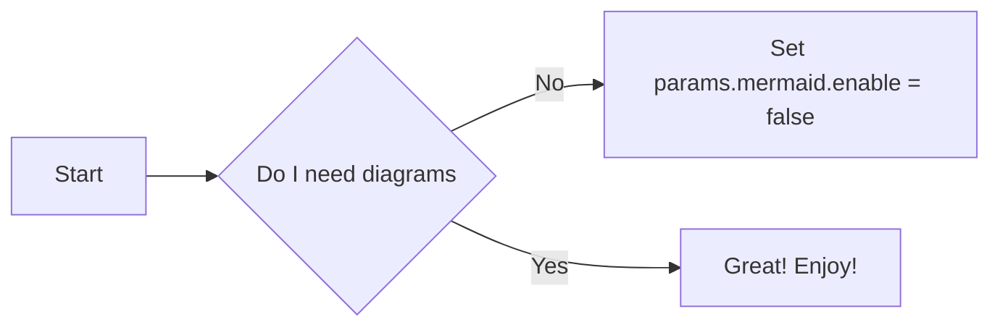

图表已提供了多种类型的对象（chart object）。但是你也可以实现自己的对象，以扩展图表的功能。

```mermaid
graph LR
  Start --> Need{"Do I need diagrams"}
  Need -- No --> Off["Set params.mermaid.enable = false"]
  Need -- Yes --> HaveFun["Great!  Enjoy!"]
```